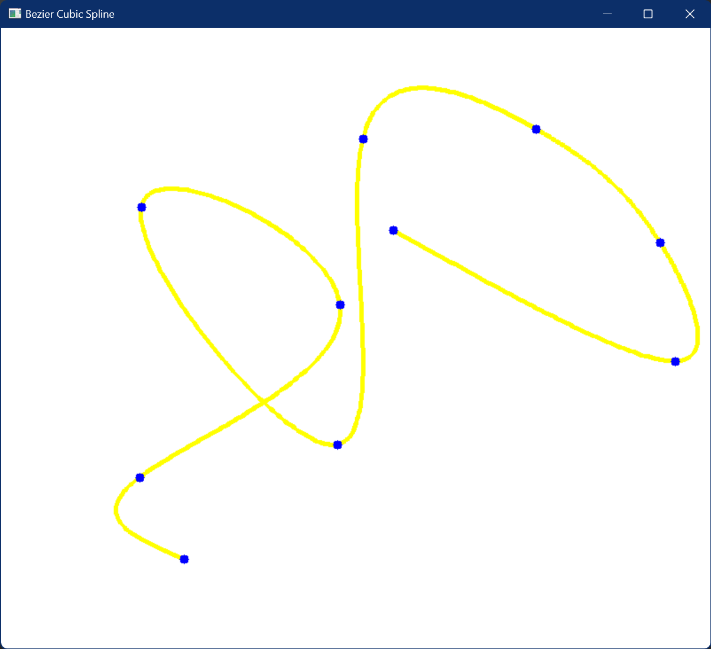
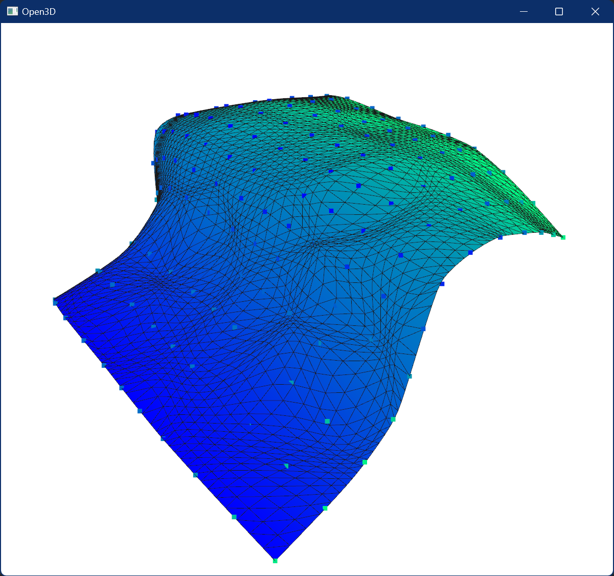

## КОНТРОЛЬНА РОБОТА “СПЛАЙНИ”
### Варіант 7

Вершини для першого та другого завдання містяться у [json файлі](resources/7.json).
В ньому містяться:
- “curve” - список 2D точок для побудови кривої
- “surface” -> “gridSize” - розмір сітки (13 x 13)
- “surface” -> “points” - одновимірний список 3D точок розміром 169. Кожна точка має індекс рядка та стовпчика в сітці (13 x 13), які записані в списку “surface” -> “indices”. 
### Завдання:

#### 1. Для заданої множини контрольних точок на площині побудувати сплайн Безьє:  

#### 2. Для заданої множини контрольних точок у просторі (13x13 points) побудувати поверхню NURBS:

